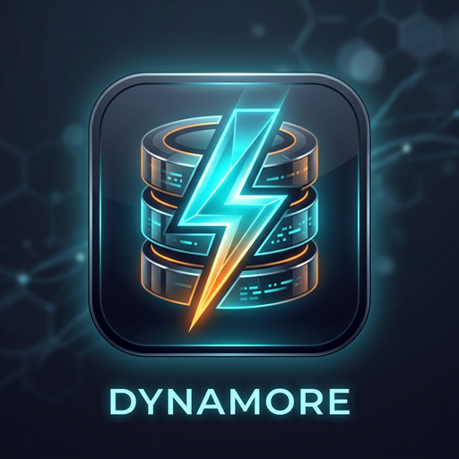

# ⚡ Dynamore v2

### A sleek, high-performance DynamoDB desktop client for power users.



[](https://opensource.org/licenses/MIT)
[](https://reactjs.org/)
[](https://tauri.app/)
[](https://www.rust-lang.org/)
[](https://aws.amazon.com/sdk-for-javascript/)

Dynamore is a modern, cross-platform desktop application designed to make managing AWS DynamoDB tables and data effortless. Built with **Tauri v2**, **Rust**, **React 18**, and **Vite**, it delivers exceptional performance, minimal memory footprint, and a responsive experience.

---

## ✨ Key Features

- **🔐 AWS SSO Integration**: Securely connect using your AWS Identity Center profiles.
- **🏗️ Table Management**: Create, inspect, and delete tables with an intuitive wizard.
- **🔍 Advanced Querying**: Build complex queries with a dedicated Query Builder.
- **📊 Scan Capability**: Flexible scan operations with real-time filtering.
- **📝 JSON Item Editor**: Edit DynamoDB items directly in a streamlined JSON editor.
- **🎨 Modern UI**: Beautiful dark-themed interface built with Ant Design and custom glassmorphism effects.
- **⚡ Blazing Fast**: Powered by Tauri v2 and Rust native backend for minimal memory footprint and fast startup times.

---

## 🚀 Getting Started

### Prerequisites

- [Node.js](https://nodejs.org/) (v20 or higher)
- [npm](https://www.npmjs.com/)
- [Rust](https://www.rust-lang.org/tools/install) (stable toolchain)

### Installation

1. Clone the repository:
   ```bash
   git clone https://github.com/nuwanwimalasena/dynamore.git
   cd dynamore
   ```

2. Install frontend dependencies:
   ```bash
   npm install
   ```

### Running in Development

#### Web Server (Vite)
To run the web development server:
```bash
npm run dev
```
Access the application at `http://localhost:5173`.

#### Native Tauri Desktop App
To run the desktop application natively with Rust live-reload:
```bash
npm run tauri dev
```

### Building for Production

To build the frontend assets:
```bash
npm run build
```

To compile and package the native desktop application for your platform:
```bash
npm run tauri build
```

---

## 🛠️ Built With

- **[Tauri v2](https://tauri.app/)**: Next-generation light-weight desktop framework.
- **[Rust](https://www.rust-lang.org/)**: Native backend performance and security.
- **[Vite](https://vitejs.dev/)**: Next-generation frontend tooling.
- **[React 18](https://reactjs.org/)**: Modern UI library.
- **[Ant Design](https://ant.design/)**: Enterprise-class UI design system.
- **[Zustand](https://github.com/pmndrs/zustand)**: Lightweight state management.
- **[AWS SDK for JavaScript v3](https://aws.amazon.com/sdk-for-javascript/)**: Modular AWS integration.

---

## 🚀 Automated Release Pipeline

This project uses **GitHub Actions** (`.github/workflows/release.yml`) to automatically build native installers (Linux AppImage/DEB, macOS DMG/AppBundle, Windows NSIS/MSI) upon pushing a version tag:

```bash
git tag v2.1.0
git push origin dev --tags
```

---

## 📄 License

Distributed under the MIT License. See `LICENSE` for more information.

---

<p align="center">
  Made with ❤️ for the AWS community.
</p>
