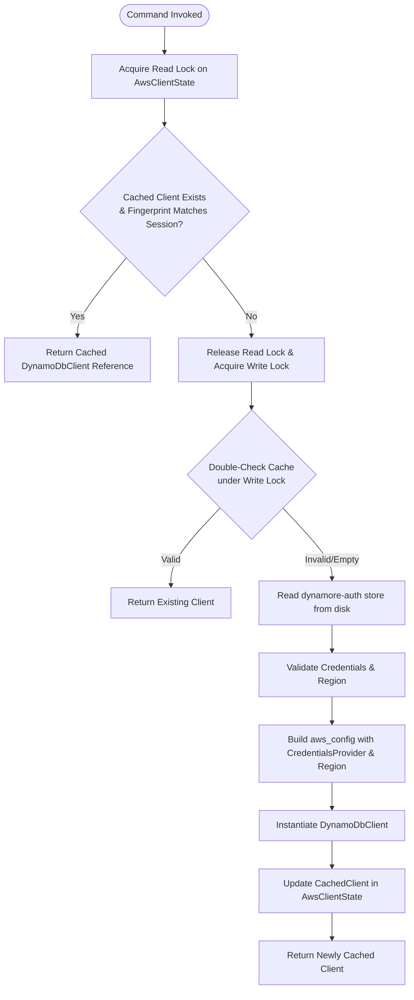
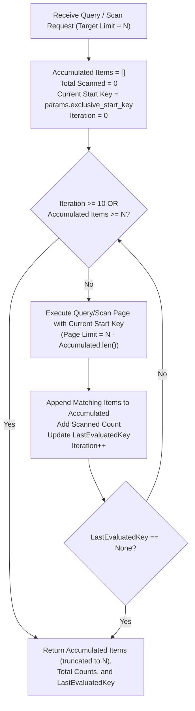

# Business Logic Models & Algorithms: Unit `aws-sdk-fix`

## 1. Managed AWS Client Caching & Resolution Algorithm



### Text Alternative
```
1. Command invokes get_dynamodb_client(state, app).
2. Acquire read lock on AwsClientState.
3. Check if cached client exists and matches current session fingerprint (region, access key, token).
   - If yes: Return cached DynamoDbClient.
4. If no: Acquire write lock.
5. Double-check cache under write lock to prevent race conditions.
6. Read active session from "dynamore-auth" store.
7. Sanitize credentials (filter empty session token string).
8. Build aws_config with latest BehaviorVersion, explicit Region, and CredentialsProvider.
9. Instantiate new DynamoDbClient and store in CachedClient with current fingerprint.
10. Return client instance to caller.
```

---

## 2. Query & Scan Auto-Pagination & Accumulation Algorithm



### Text Alternative
```
1. Receive Query or Scan params with requested limit N (default e.g. 50 if limit not provided, or custom limit).
2. Initialize:
   - accumulated_items = []
   - total_scanned = 0
   - current_start_key = params.exclusive_start_key
   - iteration = 0, max_iterations = 10
3. Loop while iteration < max_iterations and accumulated_items.len() < N:
   a. Calculate remaining limit = N - accumulated_items.len().
   b. Construct AWS SDK Query or Scan request with remaining limit and current_start_key.
   c. Execute .send().await.
   d. Add page scanned_count to total_scanned.
   e. If items returned: deserialized items via serde_dynamo, append to accumulated_items.
   f. Update current_start_key = page.last_evaluated_key.
   g. If current_start_key is None (End of Data): break loop.
   h. Increment iteration.
4. Truncate accumulated_items to N if slightly exceeded.
5. Return QueryResultPayload { items: accumulated_items, count: accumulated_items.len(), scanned_count: total_scanned, last_evaluated_key: current_start_key }.
```

---

## 3. AttributeValue Marshaling & Sanitization Algorithm

```rust
// Sanitizes incoming JSON expression values and converts to DynamoDB AttributeValues
pub fn json_map_to_attribute_map(
    map: HashMap<String, serde_json::Value>,
) -> Result<HashMap<String, AttributeValue>, String> {
    let mut item_map = HashMap::new();
    for (k, v) in map {
        // Skip null or undefined placeholder values if appropriate
        let attr = serde_dynamo::to_attribute_value(v)
            .map_err(|e| format!("Failed to serialize attribute '{}': {}", k, e))?;
        item_map.insert(k, attr);
    }
    Ok(item_map)
}
```

---

## 4. Batch Delete Chunking & Execution Algorithm
1. Receive list of key JSON objects: `keys: Vec<serde_json::Value>`.
2. Split keys into chunks of at most 25 elements: `keys.chunks(25)`.
3. For each chunk:
   a. Map each key JSON object into `HashMap<String, AttributeValue>` via `serde_dynamo`.
   b. Build `aws_sdk_dynamodb::types::WriteRequest` containing `DeleteRequest`.
   c. Call `client.batch_write_item().request_items(table_name, write_requests).send().await`.
   d. Handle unprocessed items with backoff retry if returned.
4. Return `BatchDeleteResult { deleted_count: keys.len() }`.
