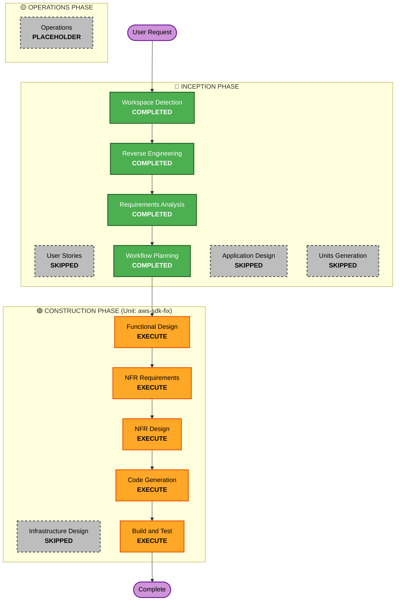

# Execution Plan: AWS SDK Operations Revisit & Bug Fix

## Detailed Analysis Summary

### Transformation Scope (Brownfield)
- **Transformation Type**: Application & IPC Contract Overhaul (Single Unit: `aws-sdk-fix`)
- **Primary Changes**:
  1. Standardize IPC error propagation across all Rust commands to native `Result<T, String>`.
  2. Implement managed AWS client caching in `tauri::State` with session/region invalidation.
  3. Implement robust schema-aware `AttributeValue` conversion & sanitization.
  4. Implement auto-pagination / accumulation loop for queries and scans with filter expressions.
  5. Harden table creation and description parsers against schema discrepancies.
  6. Align frontend TypeScript `src/api.ts` and store invocations with unified promise rejection handling.
- **Related Components**:
  - `src-tauri/src/aws_client.rs`
  - `src-tauri/src/commands/tables.rs`
  - `src-tauri/src/commands/items.rs`
  - `src-tauri/src/commands/query.rs`
  - `src-tauri/src/commands/auth.rs`
  - `src-tauri/src/main.rs`
  - `src/api.ts`
  - `src/store/appStore.ts`
  - `src/pages/` and `src/components/`

### Change Impact Assessment
- **User-facing changes**: Improved query/scan results completeness when filtering, faster UI response due to cached clients, and clearer error notifications on failure.
- **Structural changes**: Introduction of Tauri managed state for `AwsClientState` cache.
- **Data model changes**: None (DynamoDB table schemas preserved).
- **API changes**: Standardized Rust command return types (`Result<T, String>`) and updated TypeScript IPC client wrappers.
- **NFR impact**: High positive impact on reliability, resilience against transient/throttling errors, and security hardening.

### Risk Assessment
- **Risk Level**: Medium (touches core IPC bridge and all DynamoDB operations)
- **Rollback Complexity**: Easy (Git-managed code changes, no database migrations)
- **Testing Complexity**: Moderate (verification across table lifecycle, CRUD, queries with filters, and SSO/Keys login)

---

## Workflow Visualization



### Text Alternative
```
Phase 1: INCEPTION
- Workspace Detection (COMPLETED)
- Reverse Engineering (COMPLETED)
- Requirements Analysis (COMPLETED)
- User Stories (SKIPPED - internal bug fix)
- Workflow Planning (COMPLETED)
- Application Design (SKIPPED - existing architecture boundaries preserved)
- Units Generation (SKIPPED - single unit of work: aws-sdk-fix)

Phase 2: CONSTRUCTION (Unit: aws-sdk-fix)
- Functional Design (EXECUTE - design error protocols, client caching, type marshaling, pagination algorithms)
- NFR Requirements (EXECUTE - assess security and resiliency baseline requirements)
- NFR Design (EXECUTE - design timeouts, retry policies, credential stripping, structured error logging)
- Infrastructure Design (SKIPPED - no cloud infrastructure changes)
- Code Generation (EXECUTE - implement Rust backend & TypeScript frontend changes)
- Build and Test (EXECUTE - build verification, test scripts, and end-to-end checks)

Phase 3: OPERATIONS
- Operations (PLACEHOLDER)
```

---

## Phases & Stages Determination

### 🔵 INCEPTION PHASE
- [x] **Workspace Detection** (COMPLETED)
- [x] **Reverse Engineering** (COMPLETED)
- [x] **Requirements Analysis** (COMPLETED)
- [x] **User Stories** (SKIPPED) — *Rationale:* Internal reliability and SDK bug fix without new user personas or UX flows.
- [x] **Workflow Planning** (COMPLETED)
- [ ] **Application Design** (SKIPPED) — *Rationale:* Component boundaries between Tauri webview and Rust core remain intact; no new external microservices.
- [ ] **Units Generation** (SKIPPED) — *Rationale:* Single unit of work (`aws-sdk-fix`) encompasses all backend and frontend changes.

### 🟢 CONSTRUCTION PHASE (Unit: `aws-sdk-fix`)
- [ ] **Functional Design** (EXECUTE) — *Rationale:* Formalize data structures, IPC return types, client caching pattern, and pagination accumulation logic.
- [ ] **NFR Requirements** (EXECUTE) — *Rationale:* Assess Security Baseline and Resiliency Baseline rules.
- [ ] **NFR Design** (EXECUTE) — *Rationale:* Design timeouts, retry policies, sanitized error envelopes, and least-privilege credential handling.
- [ ] **Infrastructure Design** (SKIPPED) — *Rationale:* Desktop client application; no CDK, Terraform, or cloud resource provisioning required.
- [ ] **Code Generation** (EXECUTE) — *Rationale:* Planning and implementation of Rust backend commands and TypeScript frontend adaptations.
- [ ] **Build and Test** (EXECUTE) — *Rationale:* Verification of compilation, type checking, and operational test instructions.

### 🟡 OPERATIONS PHASE
- [ ] **Operations** (PLACEHOLDER) — *Rationale:* Future release automation.

---

## Estimated Timeline & Success Criteria
- **Total Executing Stages**: 6 stages (Functional Design → NFR Requirements → NFR Design → Code Gen → Build & Test)
- **Primary Goal**: Fully reliable, uniform, and robust AWS SDK operation across all DynamoDB and authentication commands.
- **Key Deliverables**:
  1. Standardized `Result<T, String>` IPC contract across all command handlers.
  2. Persistent, cached `DynamoDbClient` in Tauri state.
  3. Resilient `serde_dynamo` attribute marshaling with input sanitization.
  4. Auto-accumulating query and scan pagination.
  5. Clean build and TypeScript type check (`npm run build`).
