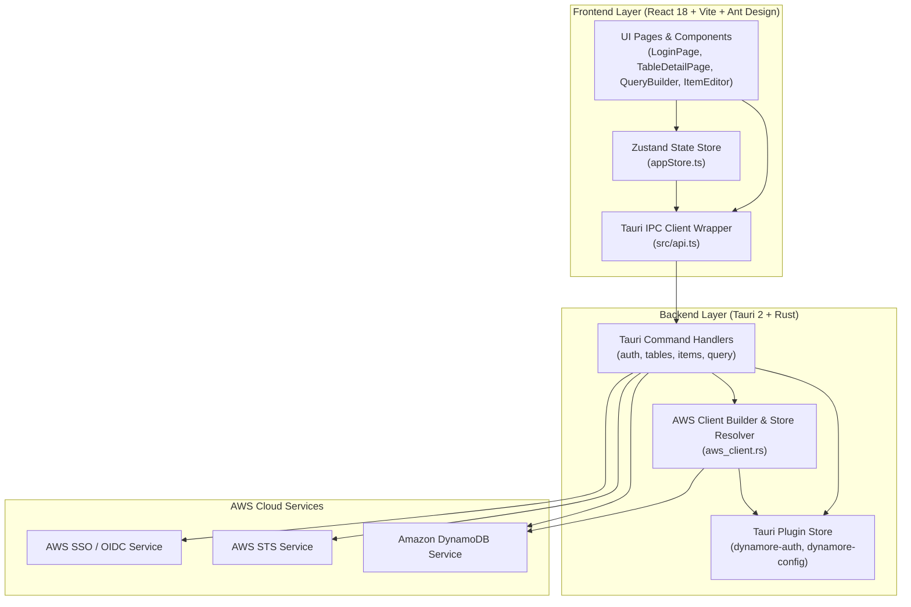
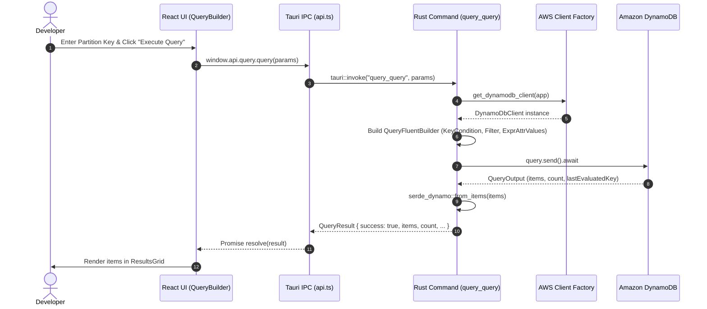

# System Architecture

## System Overview
Dynamore is architected as a native desktop application powered by **Tauri 2** (Rust core) and **React 18** (TypeScript frontend). The user interface runs within a native webview, invoking Rust backend commands via asynchronous IPC bridges. The Rust core interacts directly with AWS APIs via the official **AWS SDK for Rust** (`aws-sdk-dynamodb`, `aws-sdk-sso`, `aws-sdk-ssooidc`, `aws-sdk-sts`), eliminating the need for local Node.js child processes or heavy Chromium runtimes.

## Architecture Diagram



### Text Alternative
```
[Frontend Layer (React 18 + Vite + Ant Design)]
  UI Components (LoginPage, TableDetailPage, QueryBuilder, ItemEditor)
    |--> Zustand App Store (appStore.ts)
    |--> Tauri IPC Client Wrapper (src/api.ts)
           |
           v (Tauri IPC Invocation)
[Backend Layer (Tauri 2 + Rust)]
  Tauri Command Handlers (commands/auth.rs, commands/tables.rs, commands/items.rs, commands/query.rs)
    |--> Plugin Store (tauri-plugin-store: "dynamore-auth", "dynamore-config")
    |--> AWS Client Builder (aws_client.rs)
           |
           v (AWS SDK for Rust async requests)
[AWS Cloud Services]
  |--> AWS SSO OIDC (Client registration, device authorization, token exchange)
  |--> AWS SSO (List accounts, list roles, get role credentials)
  |--> AWS STS (Get caller identity, session verification)
  |--> Amazon DynamoDB (Table metadata, queries, scans, item CRUD)
```

## Component Descriptions

### `src/renderer` & `src/pages`
- **Purpose**: Interactive user interface views.
- **Responsibilities**:
  - `LoginPage.tsx`: Renders SSO and IAM Key login tabs, displays real-time progress events during SSO authorization, and validates login inputs.
  - `TableDetailPage.tsx`: Displays overview tabs, key schema, GSIs, LSIs, throughput metrics, and tab switches between Query, Scan, and Table Schema.
  - `CreateTableWizard.tsx`: Form wizard for defining primary keys, attribute types, billing modes, and secondary indexes.
  - `MainLayout.tsx`: Top header with active AWS profile/region information and quick logout trigger.
- **Type**: Application (Frontend)

### `src/components`
- **Purpose**: Reusable UI widgets and data grids.
- **Responsibilities**:
  - `Sidebar.tsx`: Searchable table list with refresh and create table triggers.
  - `QueryBuilder.tsx` & `ScanBuilder.tsx`: Visual condition and filter builder generating DynamoDB expressions.
  - `ResultsGrid.tsx`: Dynamic Ant Design table rendering variable DynamoDB attributes with JSON view and item action buttons.
  - `ItemEditor.tsx`: Modal dialog for creating and updating items with JSON and field-by-field editors.
- **Type**: Application (Frontend)

### `src/store/appStore.ts`
- **Purpose**: Central client-side state repository.
- **Responsibilities**: Maintains authenticated session data, current selected table, cached table list, active items result set, and loading indicators.
- **Type**: Application (Frontend)

### `src-tauri/src/aws_client.rs`
- **Purpose**: Central AWS DynamoDB client factory and session resolver.
- **Responsibilities**: Reads stored credentials from persistent `tauri-plugin-store` (`dynamore-auth`), cleans empty/optional tokens, configures the `aws_config` SDK provider with region and credentials, and instantiates the `aws_sdk_dynamodb::Client`.
- **Type**: Application (Backend)

### `src-tauri/src/commands/`
- **Purpose**: Tauri IPC command handlers.
- **Responsibilities**:
  - `auth.rs`: Implements SSO OIDC device registration, browser launching, token polling, account/role enumeration, STS key verification, and secure session persistence.
  - `tables.rs`: Implements `tables_list`, `tables_describe`, `tables_create`, and `tables_delete` with full SDK-to-JSON serialization.
  - `items.rs`: Implements `items_put`, `items_get`, `items_update`, `items_delete`, and `items_batch_delete` using `serde_dynamo`.
  - `query.rs`: Implements `query_query` and `query_scan` mapping query parameters and converting `AttributeValue` responses.
- **Type**: Application (Backend)

## Data Flow



### Text Alternative
```
1. User enters Partition Key and clicks "Execute Query".
2. React UI calls `window.api.query.query(params)`.
3. Tauri IPC bridge invokes the Rust `query_query` command handler.
4. Rust handler calls `get_dynamodb_client(app)` to retrieve an authenticated DynamoDbClient.
5. Rust handler constructs the AWS SDK query fluent builder with key conditions, filters, and serialized AttributeValues.
6. AWS SDK sends asynchronous request to Amazon DynamoDB API.
7. DynamoDB returns QueryOutput with matching items and evaluation metadata.
8. Rust handler deserializes DynamoDB AttributeValues into JSON Value structures via `serde_dynamo`.
9. Rust handler returns QueryResult object over Tauri IPC.
10. UI receives parsed response and updates the ResultsGrid table.
```

## Integration Points
- **AWS SSO OIDC (`aws-sdk-ssooidc`)**: `RegisterClient`, `StartDeviceAuthorization`, `CreateToken`.
- **AWS SSO (`aws-sdk-sso`)**: `ListAccounts`, `ListAccountRoles`, `GetRoleCredentials`.
- **AWS STS (`aws-sdk-sts`)**: `GetCallerIdentity` for credential validation.
- **Amazon DynamoDB (`aws-sdk-dynamodb`)**:
  - `ListTables`, `DescribeTable`, `CreateTable`, `DeleteTable`
  - `GetItem`, `PutItem`, `UpdateItem`, `DeleteItem`, `BatchWriteItem`
  - `Query`, `Scan`
- **Local Persistence (`tauri-plugin-store`)**: Stores auth tokens, session metadata, and last used SSO configurations on the user's local filesystem.
- **Operating System Shell (`open` crate / `tauri-plugin-shell`)**: Automatically opens default system web browser for AWS SSO verification URLs.

## Infrastructure Components
- **Deployment Model**: Native Cross-Platform Desktop Binary (macOS `.dmg`/`.app`, Windows `.msi`/`.exe`, Linux `.AppImage`/`.deb`).
- **Networking**: Direct HTTPS (port 443) outbound traffic to regional AWS service endpoints (DynamoDB, STS, SSO, SSO-OIDC).
