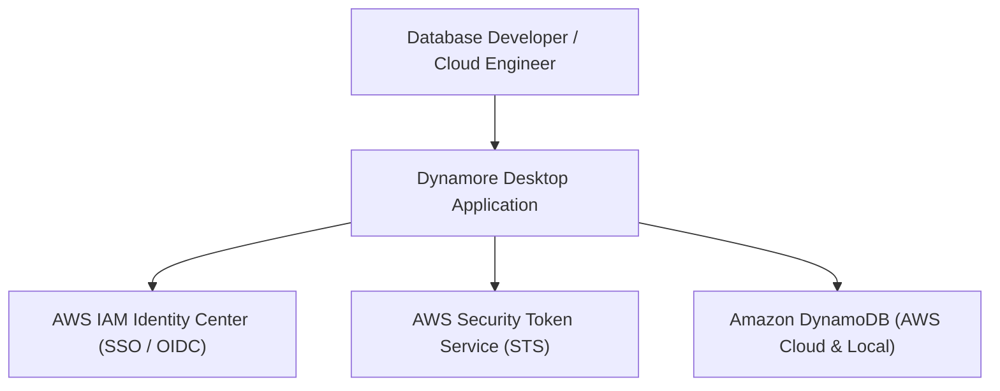

# Business Overview

## Business Context Diagram



### Text Alternative
```
User (Database Developer / Cloud Engineer)
  |--> Dynamore Desktop Application
         |--> AWS IAM Identity Center (SSO / OIDC Device Flow)
         |--> AWS Security Token Service (STS Key Verification)
         |--> Amazon DynamoDB Service (Table Management, Data Exploration, CRUD, Query & Scan)
```

## Business Description
- **Business Description**: Dynamore is a cross-platform desktop client for Amazon DynamoDB designed for developers, DevOps engineers, and cloud architects. It provides a visual workspace for managing DynamoDB schemas, inspecting table configurations, executing queries and scans, editing items (JSON and form view), and authenticating seamlessly using AWS IAM Identity Center (SSO) or direct IAM Access Keys.
- **Business Transactions**:
  1. **SSO Device Authorization & Authentication**: Initiating device authorization flows, polling for OIDC tokens, listing assigned accounts and roles, and retrieving temporary STS role credentials.
  2. **Direct IAM Credentials Login**: Authenticating via Access Key ID, Secret Access Key, optional Session Token, and AWS Region with STS Caller Identity verification.
  3. **Session & Profile Management**: Caching active session state securely and maintaining recent SSO login configurations for single-click re-authentication.
  4. **Table Schema Exploration & Management**: Listing available tables in the selected AWS region, fetching full table metadata (primary keys, GSIs, LSIs, billing mode, provisioned throughput, size, item count), creating new tables with custom schema definitions, and deleting existing tables.
  5. **Item Data Operations (CRUD)**: Viewing table items, creating new items (`PutItem`), fetching items by primary key (`GetItem`), modifying existing records (`UpdateItem`), and deleting single or batch items (`DeleteItem`, `BatchWriteItem`).
  6. **Query & Scan Data Exploration**: Running indexed queries with Partition and Sort key conditions, filter expressions, limit controls, and pagination (`ExclusiveStartKey` / `LastEvaluatedKey`), as well as full table scans.
- **Business Dictionary**:
  - **Partition Key (HASH)**: Primary key attribute used by DynamoDB to distribute data across physical storage partitions.
  - **Sort Key (RANGE)**: Optional secondary primary key attribute used to order items within the same partition.
  - **Global Secondary Index (GSI)**: An index with a partition key and a sort key that can be different from those on the base table.
  - **Local Secondary Index (LSI)**: An index that has the same partition key as the table, but a different sort key.
  - **Provisioned Throughput**: Capacity mode specifying allocated Read Capacity Units (RCU) and Write Capacity Units (WCU).
  - **Pay-Per-Request (On-Demand)**: Flexible billing option where DynamoDB charges per read/write request.
  - **SSO OIDC Device Flow**: OAuth 2.0 device authorization grant allowing desktop app login through the browser.

## Component Level Business Descriptions
### `dynamore` Frontend (React + Vite + Ant Design + Zustand)
- **Purpose**: Provides the visual user interface, interactive forms, table inspectors, Monaco/JSON editors, query builders, and application state management.
- **Responsibilities**:
  - Render login interface supporting AWS SSO and IAM access keys.
  - Render table navigation sidebar with search and quick actions.
  - Provide table detail inspection, query/scan builder interface, and results data grid.
  - Provide item creation and modification dialogs.
  - Communicate with backend through Tauri IPC channels.

### `app_lib` Backend (Tauri 2 + Rust + AWS SDK)
- **Purpose**: Native desktop process orchestrating secure OS-level keychain/store operations and executing AWS SDK API calls.
- **Responsibilities**:
  - Handle AWS SSO OIDC client registration, device authorization, and token polling.
  - Manage AWS STS credential acquisition and caller identity validation.
  - Construct and execute AWS DynamoDB SDK operations (`ListTables`, `DescribeTable`, `CreateTable`, `DeleteTable`, `GetItem`, `PutItem`, `UpdateItem`, `DeleteItem`, `BatchWriteItem`, `Query`, `Scan`).
  - Serialize and deserialize DynamoDB AttributeValues to and from frontend JSON.
