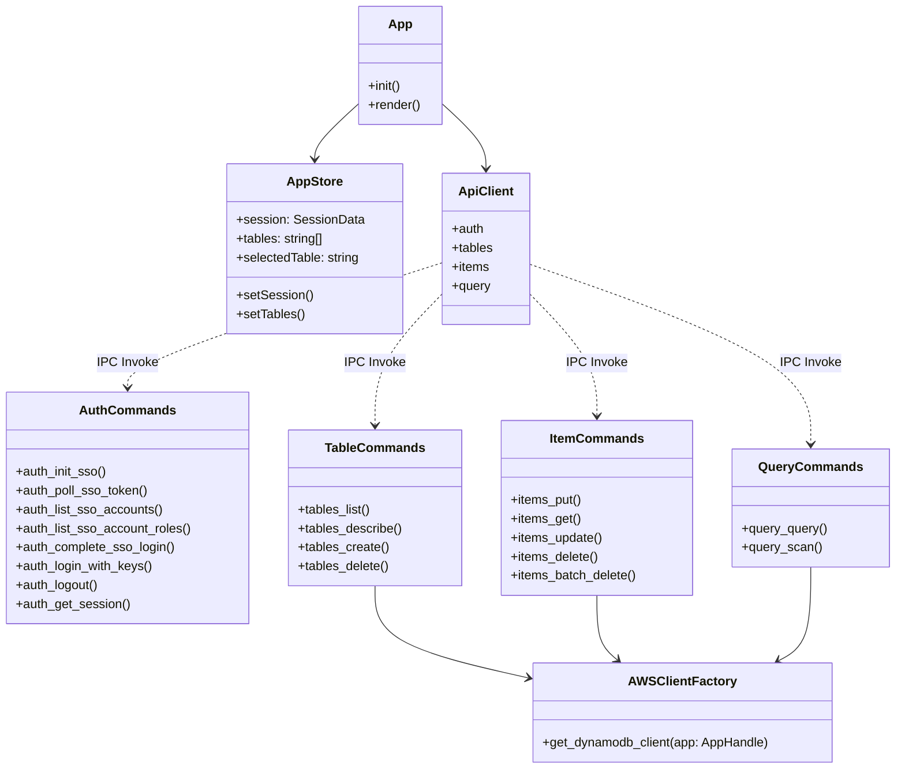

# Code Structure

## Build System
- **Frontend Build**: Vite 5 + TypeScript (`package.json`, `tsconfig.json`, `tsconfig.web.json`, `vite.config.ts`).
- **Backend Build**: Cargo + Tauri CLI (`src-tauri/Cargo.toml`, `src-tauri/tauri.conf.json`, `src-tauri/build.rs`).
- **Unified Toolchain**: `npm run dev` starts Vite development server, `npm run build` runs `tsc && vite build`, and `npm run tauri dev` compiles the Rust binary and launches the desktop app.

## Key Classes & Modules



### Text Alternative
```
[Frontend]
  App.tsx
    |--> AppStore (Zustand)
    |--> ApiClient (src/api.ts)
           |
           v (Tauri IPC Invocation)
[Rust Backend]
  - AuthCommands (commands/auth.rs)
  - TableCommands (commands/tables.rs) --> AWSClientFactory (aws_client.rs)
  - ItemCommands (commands/items.rs)   --> AWSClientFactory (aws_client.rs)
  - QueryCommands (commands/query.rs)  --> AWSClientFactory (aws_client.rs)
```

## Existing Files Inventory

### Frontend Source Files (`src/`)
- [`src/renderer/main.tsx`](file:///development/foss/dynamore/src/renderer/main.tsx): Frontend entry point mounting the React root and Ant Design ConfigProvider.
- [`src/renderer/index.html`](file:///development/foss/dynamore/src/renderer/index.html): HTML shell for the webview container.
- [`src/App.tsx`](file:///development/foss/dynamore/src/App.tsx): Root routing container checking initial auth session and conditionally rendering `LoginPage` or `MainLayout`.
- [`src/api.ts`](file:///development/foss/dynamore/src/api.ts): Central TypeScript IPC client exposing typed methods (`api.auth`, `api.tables`, `api.items`, `api.query`) invoking Tauri backend commands.
- [`src/theme.ts`](file:///development/foss/dynamore/src/theme.ts): Ant Design custom design tokens and theme configuration.
- [`src/index.css`](file:///development/foss/dynamore/src/index.css): Global styling, dark theme rules, scrollbars, and layout dimensions.
- [`src/store/appStore.ts`](file:///development/foss/dynamore/src/store/appStore.ts): Zustand global store holding active session, table lists, and navigation state.
- [`src/pages/LoginPage.tsx`](file:///development/foss/dynamore/src/pages/LoginPage.tsx): Complete authentication screen supporting AWS SSO device flow and IAM access keys.
- [`src/pages/MainLayout.tsx`](file:///development/foss/dynamore/src/pages/MainLayout.tsx): Core application shell with sidebar table navigation, header, and content switch.
- [`src/pages/TableDetailPage.tsx`](file:///development/foss/dynamore/src/pages/TableDetailPage.tsx): Table inspector view with metadata tabs, Query builder, Scan builder, and data results.
- [`src/pages/CreateTableWizard.tsx`](file:///development/foss/dynamore/src/pages/CreateTableWizard.tsx): Wizard modal for designing and provisioning new DynamoDB tables.
- [`src/components/Sidebar.tsx`](file:///development/foss/dynamore/src/components/Sidebar.tsx): Table list browser with filtering, active selection, and refresh controls.
- [`src/components/QueryBuilder.tsx`](file:///development/foss/dynamore/src/components/QueryBuilder.tsx): Interactive query form generating Partition Key, Sort Key, and index queries.
- [`src/components/ScanBuilder.tsx`](file:///development/foss/dynamore/src/components/ScanBuilder.tsx): Interactive scan form for whole-table and secondary index scans with filters.
- [`src/components/ResultsGrid.tsx`](file:///development/foss/dynamore/src/components/ResultsGrid.tsx): Data table rendering items with attribute column sorting, JSON inspection, and deletion actions.
- [`src/components/ItemEditor.tsx`](file:///development/foss/dynamore/src/components/ItemEditor.tsx): Modal dialog for item creation and modification in both form view and raw JSON view.
- [`src/components/UpdateNotification.tsx`](file:///development/foss/dynamore/src/components/UpdateNotification.tsx): Desktop update checker and notification modal.
- [`src/types/global.d.ts`](file:///development/foss/dynamore/src/types/global.d.ts): TypeScript interface declarations for DynamoDB table descriptions, items, and API shapes.

### Backend Source Files (`src-tauri/`)
- [`src-tauri/src/main.rs`](file:///development/foss/dynamore/src-tauri/src/main.rs): Application entry point registering Tauri plugins and command handlers.
- [`src-tauri/src/lib.rs`](file:///development/foss/dynamore/src-tauri/src/lib.rs): Library exports for the Rust package.
- [`src-tauri/src/aws_client.rs`](file:///development/foss/dynamore/src-tauri/src/aws_client.rs): DynamoDB client factory configuring `aws-sdk-dynamodb` using credentials from `dynamore-auth` store.
- [`src-tauri/src/commands/mod.rs`](file:///development/foss/dynamore/src-tauri/src/commands/mod.rs): Submodule exporter for Tauri command modules.
- [`src-tauri/src/commands/auth.rs`](file:///development/foss/dynamore/src-tauri/src/commands/auth.rs): AWS SSO OIDC registration, device code polling, account/role enumeration, STS key verification, and session persistence.
- [`src-tauri/src/commands/tables.rs`](file:///development/foss/dynamore/src-tauri/src/commands/tables.rs): Handlers for `tables_list`, `tables_describe`, `tables_create`, and `tables_delete`.
- [`src-tauri/src/commands/items.rs`](file:///development/foss/dynamore/src-tauri/src/commands/items.rs): Handlers for `items_put`, `items_get`, `items_update`, `items_delete`, and `items_batch_delete`.
- [`src-tauri/src/commands/query.rs`](file:///development/foss/dynamore/src-tauri/src/commands/query.rs): Handlers for `query_query` and `query_scan`.
- [`src-tauri/Cargo.toml`](file:///development/foss/dynamore/src-tauri/Cargo.toml): Rust dependencies and build metadata.
- [`src-tauri/tauri.conf.json`](file:///development/foss/dynamore/src-tauri/tauri.conf.json): Tauri desktop runtime configuration.

## Design Patterns

### 1. IPC Command Dispatcher Pattern
- **Location**: `src/api.ts` and `src-tauri/src/commands/`
- **Purpose**: Decouples the frontend presentation layer from direct native API calls, providing type safety and unified error trapping across the IPC boundary.
- **Implementation**: Frontend calls named methods on `window.api`, which invoke Tauri Rust handlers annotated with `#[tauri::command]`.

### 2. Client Factory & Store Resolver Pattern
- **Location**: `src-tauri/src/aws_client.rs`
- **Purpose**: Eliminates boilerplate across all DynamoDB commands by dynamically retrieving active session credentials and constructing pre-authenticated SDK clients on demand.
- **Implementation**: Function `get_dynamodb_client(app: AppHandle)` fetches credentials from `dynamore-auth` store, sanitizes session tokens, and instantiates `aws_sdk_dynamodb::Client`.

### 3. Asynchronous Device Authorization Polling Pattern
- **Location**: `src-tauri/src/commands/auth.rs` (`auth_poll_sso_token`)
- **Purpose**: Non-blocking polling for OAuth 2.0 device flow completions with backoff handling for `AuthorizationPendingException` and `SlowDownException`.
- **Implementation**: Runs a Tokio async sleep loop while emitting progress updates to the frontend via `window.emit("auth:ssoProgress", ...)`.

### 4. DynamoDB Attribute Value Dynamic Marshaling Pattern
- **Location**: `src-tauri/src/commands/items.rs` and `query.rs`
- **Purpose**: Converts between arbitrary JSON representations in the frontend and strongly-typed DynamoDB `AttributeValue` structures in Rust.
- **Implementation**: Uses `serde_dynamo` crate to transform `serde_json::Value` to `HashMap<String, AttributeValue>` and vice versa.

## Critical Dependencies

### Backend Dependencies (`Cargo.toml`)
- `aws-sdk-dynamodb = "1.23"`: Official AWS SDK for interacting with Amazon DynamoDB.
- `aws-sdk-sso = "1.21"`: AWS SSO API for listing accounts and retrieving role credentials.
- `aws-sdk-ssooidc = "1.21"`: AWS SSO OIDC API for device registration and token polling.
- `aws-sdk-sts = "1.21"`: AWS Security Token Service for caller identity verification.
- `aws-config = "1.1"`: AWS SDK configuration loader and region/credential resolver.
- `aws-credential-types = "1.2.10"`: Strongly-typed AWS credential constructors.
- `serde_dynamo = "4"`: Direct serialization and deserialization between Rust `serde` structures and AWS SDK DynamoDB `AttributeValue`.
- `tauri = "2.11.2"`: Desktop runtime and IPC foundation.
- `tauri-plugin-store = "2"`: Local JSON persistence for auth sessions and app configs.

### Frontend Dependencies (`package.json`)
- `antd = "^5.18.3"`: Enterprise React UI component library.
- `zustand = "^4.5.4"`: Lightweight, reactive state management store.
- `@tauri-apps/api = "^2.1.1"`: Client-side TypeScript library for Tauri IPC invocations and event subscriptions.
- `react = "^18.3.1"`: React UI library.
