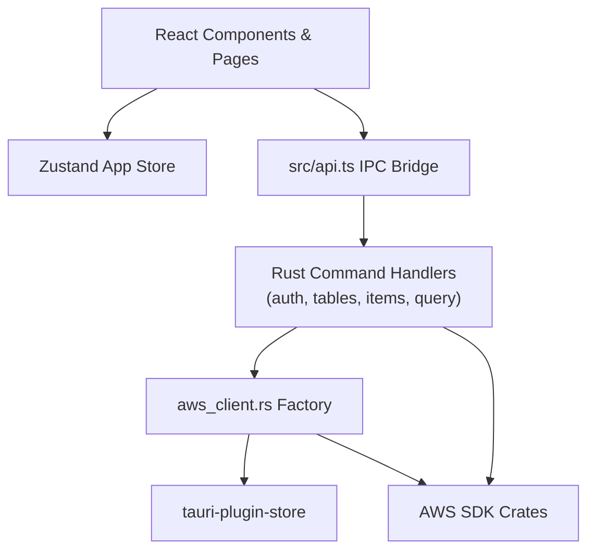

# Dependencies

## Internal Dependencies



### Text Alternative
```
React Components & Pages
  |--> Zustand App Store (appStore.ts)
  |--> src/api.ts IPC Bridge
         |--> Rust Command Handlers (commands/auth.rs, tables.rs, items.rs, query.rs)
                |--> aws_client.rs Factory
                       |--> tauri-plugin-store (dynamore-auth, dynamore-config)
                       |--> AWS SDK Crates (aws-sdk-dynamodb, aws-config)
                |--> AWS SDK Crates (aws-sdk-sso, aws-sdk-ssooidc, aws-sdk-sts)
```

## Package Dependencies Detail

### `src/api.ts` depends on `src-tauri/src/commands/`
- **Type**: IPC Contract / Runtime
- **Reason**: Dispatches JSON requests across the Tauri Webview boundary to native Rust functions.

### `src-tauri/src/commands/` depends on `src-tauri/src/aws_client.rs`
- **Type**: Compile / Runtime
- **Reason**: Obtains pre-configured `DynamoDbClient` with region and stored credentials.

### `src-tauri/src/aws_client.rs` depends on `tauri-plugin-store`
- **Type**: Compile / Runtime
- **Reason**: Retrieves stored authentication tokens and credentials from local disk storage (`dynamore-auth`).

## External Dependencies

### Rust Crates (`src-tauri/Cargo.toml`)
- `aws-sdk-dynamodb` (v1.23): Amazon DynamoDB client SDK.
- `aws-sdk-sso` (v1.21): AWS IAM Identity Center (SSO) client SDK.
- `aws-sdk-ssooidc` (v1.21): AWS SSO OIDC client SDK.
- `aws-sdk-sts` (v1.21): AWS Security Token Service client SDK.
- `aws-config` (v1.1): AWS SDK runtime environment loader.
- `aws-credential-types` (v1.2.10): AWS credential representations.
- `serde_dynamo` (v4): AttributeValue serialization and deserialization.
- `tauri` (v2.11.2): Desktop application framework.
- `tauri-plugin-store` (v2): Key-value store plugin for Tauri.
- `tauri-plugin-shell` (v2): Shell integration for opening external browser links.
- `open` (v5.3.5): Cross-platform URL opener.
- `serde` / `serde_json` (v1.0): Rust serialization framework.
- `tokio` (v1): Async runtime.

### NPM Packages (`package.json`)
- `react` & `react-dom` (v18.3.1): UI rendering engine.
- `antd` (v5.18.3): UI component library.
- `@ant-design/icons` (v5.3.7): Ant Design icon set.
- `zustand` (v4.5.4): State management library.
- `@tauri-apps/api` (v2.1.1): Tauri client IPC library.
- `vite` (v5.3.1): Build tool and dev server.
- `typescript` (v5.4.5): Type system.
